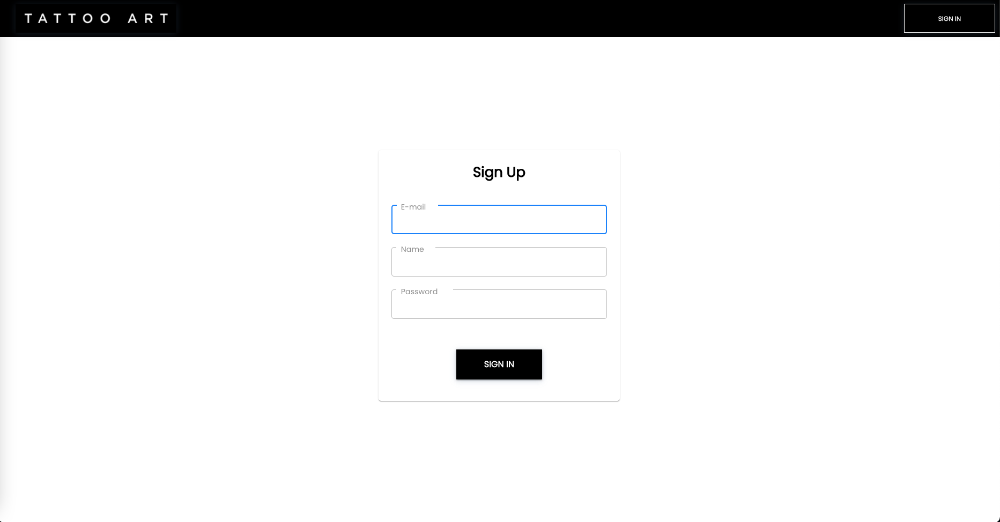

## Project Name

This is a little description about your project.

**Tech Stack:** MongoDB, Express.js, React.js, Node.js, Typescript, AWS, JWT, Stripe

**Contributors**: 
1. [Kevin](https://github.com/kqpham)
2. [Milad](https://github.com/MiladS95)
3. [Victor](https://github.com/vicscherman)

---

### Getting Started

1. Clone or download repository

---

## Server

1. Go into the server director `cd server`
2. Run `npm install` to install packages
3. Create your environment variable (.env) file
4. Run `npm run dev` to start the server

---

## Client

1. Go into the client directory `cd client`
2. Run `npm install` to install packages
3. Run `npm start` to start the client side

---

### Demo

1. Registration. Users will be able to create a new account using their email and password

2. Dashboard. Here is a description about what a user can expect to see

### Stripe Integration

1. Go into client directory `cd client` and run `npm install`
2. Go into server directory `cd server` and run `npm install`
3. In the server directory create a `.env` file and add `StripeKeyBackend=API_KEY`
4. 4. In the client directory create a `.env file and add `REACT_APP_KEY=API_KEY` (diff key from above)
